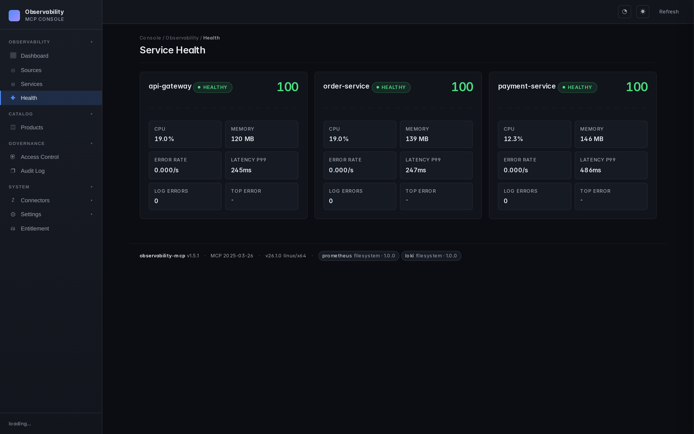
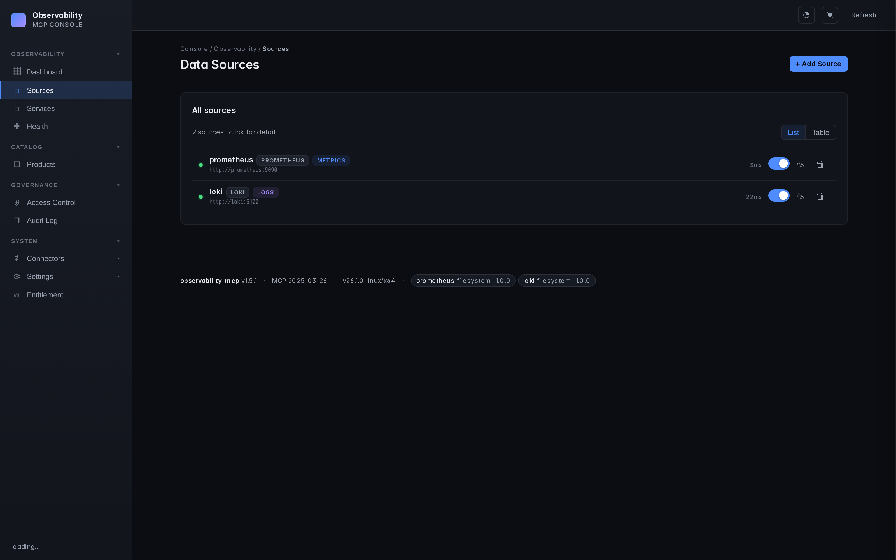
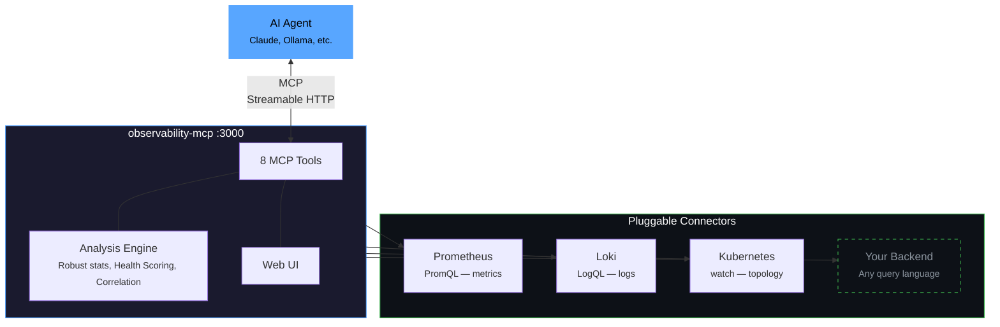

<div align="center">

# observability-mcp

**The unified observability gateway for AI agents.**

One MCP server that connects to any observability backend through pluggable connectors,
normalizes the data, adds robust anomaly analysis, and provides a web UI for configuration.

*One MCP endpoint, every backend — so an agent triaging an incident asks one normalized
question instead of juggling N vendor servers and their query languages.*

[](LICENSE)
[](https://www.npmjs.com/package/@thotischner/observability-mcp)
[](https://www.npmjs.com/package/@thotischner/observability-mcp)
[](https://github.com/ThoTischner/observability-mcp/pkgs/container/observability-mcp)
[](https://github.com/ThoTischner/observability-mcp/actions/workflows/integration.yml)
[](https://github.com/ThoTischner/observability-mcp/actions/workflows/helm-integration.yml)
[](https://github.com/ThoTischner/observability-mcp/stargazers)
[](https://www.typescriptlang.org/)
[](https://modelcontextprotocol.io)
[](./helm/observability-mcp)
[](https://artifacthub.io/packages/search?repo=observability-mcp)
[](https://docs.npmjs.com/generating-provenance-statements)
[](SECURITY.md#container-image--ghcr--scanned--cosign-signed--syft-sbom)
[](SECURITY.md#container-image--ghcr--scanned--cosign-signed--syft-sbom)
[](SECURITY.md#container-image--ghcr--scanned--cosign-signed--syft-sbom)
[](SECURITY.md#container-image--ghcr--scanned--cosign-signed--syft-sbom)
[](https://thotischner.github.io/observability-mcp/hub/)


</div>

---

📖 **Full documentation site:** <https://thotischner.github.io/observability-mcp/>

🔌 **Open in MCP Inspector** — one-line interactive explorer:
```bash
npx --yes @modelcontextprotocol/inspector \
  --config <(npx --yes @thotischner/observability-mcp inspector-config)
```

## Why it matters — measured, not asserted

On a real Kubernetes-platform-team question ("which other pods share a node with
`payment-service` so we know what else falls over if that node goes down?"), the same
local model produces wildly different answers depending on the tools you hand it:

| Tools available to the agent (llama3.1:8b, n=10) | Cross-namespace blast-radius accuracy |
|---|:---:|
| Generic metric + log + service tools | **0 / 10** &nbsp;— hallucinates the wrong entity type (`prometheus`, `loki`, `kubernetes`) |
| Same model + `get_topology` + `get_blast_radius` | **10 / 10** &nbsp;— exact correct co-tenant list, every iteration |

Raw JSON for both arms, plus three more scenarios (single-service RCA, in-namespace
blast radius, scenarios where topology does *not* help), live in
[docs/benchmark-astronomy-shop.md](docs/benchmark-astronomy-shop.md). The harness is in
[`scripts/benchmark-rca.mjs`](scripts/benchmark-rca.mjs); re-run with `make benchmark-up && make benchmark-run`.

We don't claim universal speedup — the doc spells out exactly where the topology tools
help (graph-shaped questions) and where they don't (pure single-metric drill-downs).

---

## Try it in 10 seconds

```bash
npx @thotischner/observability-mcp
# then open http://localhost:3000
```

Wire it into Claude Code with one CLI call:

```bash
claude mcp add observability --transport http http://localhost:3000/mcp
```

…or commit it to your repo as `.mcp.json` (works the same in Claude Desktop / Cursor):

```json
{
  "mcpServers": {
    "observability": {
      "transport": { "type": "http", "url": "http://localhost:3000/mcp" }
    }
  }
}
```

The server starts with **zero sources**. Add Prometheus/Loki via the Web UI or `PROMETHEUS_URL` / `LOKI_URL` env vars.

> If you'd rather have the snippets above printed by a Make target — including
> custom-host / custom-port substitution — use `make connect-claude-code` or
> `make connect-cursor`. `make doctor` round-trips a real MCP handshake against
> a running server, reports the live governance posture (auth mode, redaction,
> audit-log persistence, per-identity rate cap), and tells you what to fix if
> it can't.

> **Multi-user / production?** See [docs/access-control.md](docs/access-control.md)
> for the opt-in basic-mode login + RBAC + audit log + per-identity rate limit
> setup. All off by default; the demo above is unchanged.
>
> **SSO via OIDC?** `make demo-oidc` boots a Keycloak + an OIDC-flavored
> mcp-server on port **3001** with three pre-provisioned users
> (`admin` / `operator` / `viewer`, password = username, DEMO ONLY).
> See [docs/auth-oidc.md](docs/auth-oidc.md) for production Keycloak /
> Authentik / Auth0 / Azure AD setups.
>
> **External RBAC via OPA?** `make demo-opa` boots an Open Policy Agent
> with an example Rego policy + an OPA-backed mcp-server on port **3002**.
> See [docs/policy-engines.md](docs/policy-engines.md) for the
> built-in / file / OPA backend trade-offs and migration paths.
>
> **Curated MCP Products?** Set `OMCP_PRODUCTS_FILE` to a YAML catalog
> ([`config/products.yaml.example`](mcp-server/config/products.yaml.example))
> and ship per-tenant/per-agent tool bundles instead of "everything,
> all the time". RBAC-gated, audited, hot-editable. Details in
> [docs/products.md](docs/products.md).

Want the full chaos-engineering demo (Prometheus + Loki + 3 example services + the autonomous agent)? Clone and run:

```bash
make demo   # equivalent to: docker compose --profile demo up --build --wait
```

Or run the **sovereign quickstart** — one command, fully on-prem, zero
external calls: it starts the stack, injects a real incident, and shows
side by side what an agent gets *without* vs *with* the analysis layer (a
wall of raw numbers vs a scored verdict that pinpoints the culprit). The
optional agent reasons over it with a **local** model (Ollama):

```bash
make demo-sovereign
```

See `make help` for all canonical workflows.

## Why?

Every observability vendor ships its own MCP server — Prometheus, Grafana, Datadog, Elastic, each siloed. An AI agent triaging an incident across systems must juggle N separate servers and learn each query language (PromQL, LogQL, …). There is no unified abstraction layer.

**observability-mcp** is that layer: one MCP endpoint that normalizes every backend and answers in plain service/metric/log terms, plus an analysis engine that flags anomalies the agent would otherwise have to reconstruct from raw queries itself.

**Who it's for:** SRE / platform teams running Prometheus + Loki who use an AI agent (Claude, local LLMs, …) for incident triage. The gateway's leverage is largest when the agent is *not* a frontier model — a smaller or local model that can't reliably hand-write PromQL/LogQL benefits most from normalized tools and pre-computed analysis. A strong frontier model can query raw backends competently on its own; there the value is consistency and the analysis engine, not query convenience. We state this honestly rather than claiming a universal speedup.

## Features

- **Unified gateway** — Single MCP endpoint for all your observability backends.
- **Cross-signal analysis** — Correlates metrics and logs automatically. Robust anomaly detection (median/MAD baseline, trend detection for slow ramps, warmup + dwell to suppress flapping) and weighted health scoring.
- **Web UI** — Sources, services, health monitoring, configuration. Real-time, dark theme.
- **prom-client defaults** — Works out of the box with the standard Node.js Prometheus instrumentation. Dynamic label resolution probes `job` / `service` / `app` / `service_name` so service filtering Just Works.
- **Loki label fallback** — Discovers services through `service_name` / `service` / `job` / `app` / `container`, including Docker-shipped streams with leading slashes.
- **Pluggable connectors** — One interface, any query language (PromQL, LogQL, Flux, KQL...). See [docs/connectors.md](docs/connectors.md).
- **Auth & TLS** — Basic, Bearer, custom CA, mTLS. See [docs/auth-and-tls.md](docs/auth-and-tls.md).
- **Multi-backend** — Multiple instances of the same type, no problem.

## Detection quality

The anomaly engine is backtested against a labelled synthetic suite covering
slow ramps (memory-leak-toward-OOM), spikes, step changes, stable noise,
transient blips, one-sided recoveries, daily-seasonal patterns, and a
deliberately ambiguous low-SNR "hard" tier. Scored as a CI gate
([`backtest.test.ts`](mcp-server/src/analysis/backtest.test.ts)) — these
numbers are regenerated from that suite, not hand-written:

| Cases | Precision | Recall | F1 |
|------:|----------:|-------:|---:|
| 64 | 100.0% | 87.5% | 93.3% |

Precision is 100% (no spurious alerts); the recalled misses are by design at
the noise floor of the hard tier. The suite is deterministic and a detector
regression fails CI. Reproduce locally:

```bash
docker run --rm -w /app -v "$(pwd)/mcp-server:/app" node:20-alpine \
  sh -c "npm i --silent && npx tsx --test src/analysis/backtest.test.ts"
```

## Screenshots

| Dashboard | Service health | Connector hub |
|---|---|---|
| [](docs/screenshots/dashboard.png) | [](docs/screenshots/health.png) | [](docs/screenshots/connectors.png) |

## Architecture



## Repo layout

```
mcp-server/   # the product — server, Web UI, analysis engine, built-in plugins
helm/         # ArtifactHub-grade Helm chart
docs/         # configuration, auth, plugin architecture, airgapped deployment, ...
examples/     # demo material — agent, example services, Prometheus+Loki configs
```

`mcp-server/` is what you install. Everything under `examples/` is opt-in via `docker compose --profile demo` — it's how the repo demos chaos detection end-to-end, but production deployments don't need any of it.

## Installation

| Method | Command | Best for |
|--------|---------|----------|
| **npm** | `npx @thotischner/observability-mcp` | Local dev, Node toolchains, zero install |
| **Docker (GHCR)** | `docker run -p 3000:3000 ghcr.io/thotischner/observability-mcp:latest` | Production hosts, isolation |
| **Helm** | `helm repo add observability-mcp https://thotischner.github.io/observability-mcp/`<br>`helm install observability-mcp observability-mcp/observability-mcp` | Kubernetes |
| **From source** | `git clone … && make demo` | Full POC with example services and chaos |
| **CLI (`omcp`)** | `npm i -g @thotischner/observability-mcp` | Managing connectors, the demo stack & Helm from the terminal — see [CLI](#cli-omcp) |

GHCR is multi-arch (amd64 + arm64). Available tags: `latest`, `main`, `X.Y.Z`, `X.Y`, `X`, `sha-<commit>`. Note: the leading `v` is stripped from semver tags.

### Helm chart

The chart ships with Deployment, Service, optional Ingress/PVC/HPA, NetworkPolicy, ServiceMonitor (auto-gated on the Prometheus Operator CRD), `helm test` connection probe, and `values.schema.json` validation. ArtifactHub-grade annotations. See [`helm/observability-mcp/`](./helm/observability-mcp/) for the full values reference, or the [airgapped deployment guide](docs/airgapped-deployment.md) for a hardened production example.

```bash
helm repo add observability-mcp https://thotischner.github.io/observability-mcp/
helm repo update
helm install observability-mcp observability-mcp/observability-mcp \
  --set sources.prometheusUrl=http://prometheus.monitoring.svc.cluster.local:9090 \
  --set sources.lokiUrl=http://loki.logging.svc.cluster.local:3100
```

```yaml
# docker-compose snippet
services:
  observability-mcp:
    image: ghcr.io/thotischner/observability-mcp:latest
    ports: ["3000:3000"]
    environment:
      PROMETHEUS_URL: http://prometheus:9090
      LOKI_URL: http://loki:3100
    volumes:
      - ./mcp-config:/home/node/.observability-mcp
    restart: unless-stopped
```

For full configuration — paths, env vars, `${VAR}` substitution, complete `sources.yaml` reference — see [docs/configuration.md](docs/configuration.md).

## Quick Start

### Option A: Standalone (your own backends)

```bash
npx @thotischner/observability-mcp
```

Then open the Web UI at `http://localhost:3000`, click **Sources → + Add Source**, point at your Prometheus/Loki URLs. Or skip the UI:

```bash
PROMETHEUS_URL=http://localhost:9090 LOKI_URL=http://localhost:3100 \
  npx @thotischner/observability-mcp
```

### Option B: Grafana Cloud

Grafana Cloud uses Basic Auth with your numeric instance ID as username and an API token as password. The instance ID for Prometheus and Loki is different — find both in *Connections → Data sources*.

```yaml
# ~/.observability-mcp/sources.yaml
sources:
  - name: grafana-cloud-prom
    type: prometheus
    url: https://prometheus-prod-XX-prod-eu-west-X.grafana.net/api/prom
    enabled: true
    auth:
      type: basic
      username: "${GRAFANA_PROM_USER}"   # numeric instance ID
      password: "${GRAFANA_TOKEN}"
  - name: grafana-cloud-loki
    type: loki
    url: https://logs-prod-XXX.grafana.net
    enabled: true
    auth:
      type: basic
      username: "${GRAFANA_LOKI_USER}"   # different from Prom!
      password: "${GRAFANA_TOKEN}"
```

```bash
GRAFANA_PROM_USER=… GRAFANA_LOKI_USER=… GRAFANA_TOKEN=glc_… \
  npx @thotischner/observability-mcp
```

### Option C: Full demo (Docker Compose with example services)

```bash
git clone https://github.com/ThoTischner/observability-mcp.git
cd observability-mcp
docker compose --profile demo up --build
```

Boots a single-node **k3s** cluster, builds the three example services and runs them as Kubernetes Deployments inside k3s, plus Prometheus, Loki, Promtail, the MCP server and the agent on the docker-compose side. Open `http://localhost:3000`.

The same Deployments that Prometheus scrapes and Loki receives logs from are also what the topology graph shows — so the agent can correlate a metric/log anomaly with its underlying host using `get_blast_radius`. Chaos endpoints stay on `localhost:8080/8081/8082` (mapped to the k3s NodePorts) so existing scripts and demo videos keep working unchanged.

Without `--profile demo`, only `mcp-server` starts — useful when you already run Prometheus/Loki elsewhere and just want to expose them via MCP.

### Option D: Benchmark mode (OpenTelemetry Demo / Astronomy Shop)

For producing credible RCA numbers against a real microservice workload (~23 services, native OTel instrumentation):

```bash
make benchmark-up         # clones upstream Astronomy Shop, brings up both stacks
make benchmark-run        # runs the harness baseline vs topology, writes JSON
make benchmark-down       # tears down
```

`make benchmark-up` adds Tempo + an OTel collector bridge under our `--profile benchmark` and orchestrates the upstream stack in a separate compose project, joining their network to ours so Astronomy Shop services push traces into our Tempo. See [docs/benchmark-astronomy-shop.md](docs/benchmark-astronomy-shop.md) and [examples/benchmark/README.md](examples/benchmark/README.md). First-time pull is ~4 GB.

## MCP Tools

| Tool | Signal | Purpose |
|------|--------|---------|
| `list_sources` | meta | Discover configured backends and connection status |
| `list_services` | meta | Discover monitored services across all backends |
| `query_metrics` | metrics | Query metrics with pre-computed summary stats |
| `query_logs` | logs | Query logs with error/warning counts and top patterns |
| `get_service_health` | unified | Health score combining metrics + logs (0–100) |
| `detect_anomalies` | unified | Cross-signal anomaly detection with robust (median/MAD + trend) analysis |
| `get_topology` | topology | Return the merged infrastructure graph (resources + edges) from every topology-capable connector, filterable by source/kind/scope |
| `get_blast_radius` | topology | Pivot on the universal `RUNS_ON` relation — "if this resource's host fails, who else fails?". Works for pod→node, vm→hypervisor, container→host |

The two topology tools require a topology-capable connector. The bundled [Kubernetes connector](docs/kubernetes.md) is the first; future connectors (vCenter, NetBox, …) plug in via the same `isTopologyProvider` interface and emit `kind`/`relation` values from the canonical [topology vocabulary](docs/topology-vocabulary.md).

## Using with Claude Code

Connect Claude Code directly — no agent needed.

**CLI:**

```bash
claude mcp add observability --transport http http://localhost:3000/mcp
```

**Or `.mcp.json` in your project root** (commit-friendly):

```json
{
  "mcpServers": {
    "observability": {
      "transport": { "type": "http", "url": "http://localhost:3000/mcp" }
    }
  }
}
```

Then ask Claude in natural language. For example, after triggering chaos in the demo (`curl -X POST http://localhost:8081/chaos/error-spike`):

> *"Are there any anomalies right now?"*

Claude calls `detect_anomalies` and finds:

```json
{
  "anomalies": [
    { "metric": "cpu", "severity": "high", "service": "payment-service",
      "description": "cpu is 3.4σ above baseline (18.36 → 37.31)" },
    { "metric": "request_rate", "severity": "low", "service": "payment-service",
      "description": "request_rate is -1.8σ below baseline (0.08 → 0.04)" }
  ]
}
```

> *"Show me the error logs for payment-service."*

Claude calls `query_logs`:

```json
{
  "summary": {
    "total": 11, "errorCount": 11,
    "topPatterns": [
      "Request failed: internal error during POST /payments (6x)",
      "Request failed: internal error during POST /refunds (4x)"
    ]
  }
}
```

Claude correlates the signals — CPU spike, error logs flooding, request rate halved — and explains the incident in plain language. No PromQL, no LogQL.

## Demo: Chaos Engineering

Three example microservices generate traffic and support chaos injection:

```bash
curl -X POST http://localhost:8081/chaos/high-cpu        # CPU spike
curl -X POST http://localhost:8081/chaos/error-spike     # CPU + latency + errors
curl -X POST http://localhost:8081/chaos/slow-responses  # Latency
curl -X POST http://localhost:8081/chaos/memory-leak     # OOM logs
curl -X POST http://localhost:8081/chaos/reset
```

The agent ([docs/agent.md](docs/agent.md)) detects anomalies within 30 seconds and produces an LLM incident analysis if Ollama is running.

## CLI (`omcp`)

A control CLI ships in the same npm package (`omcp` bin) — manage connectors, the demo stack, and Helm installs.

Install it (or run ad-hoc without installing):

```bash
npm i -g @thotischner/observability-mcp   # puts `omcp` on your PATH
omcp --help

# or, no install:
npx -p @thotischner/observability-mcp omcp doctor
```

Then:

```bash
omcp doctor                       # check docker / compose / helm / node
omcp demo up                      # full demo stack (auto-picks free host ports)
omcp plugin list                  # browse the connector hub catalog
omcp plugin install tempo@1.2.0 --trust-root key.pem    # download + verify + extract
omcp plugin verify ./plugins/tempo --trust-root key.pem # offline audit
omcp helm upgrade obs -- -n monitoring --set sources.prometheusUrl=http://prom:9090
```

Plugin install/verify reuse the server's fail-closed signature + integrity
checks (offline-capable; `--offline-dir` for airgapped). Extra `helm`
flags pass through after a literal `--`.

## Docs

- [Configuration](docs/configuration.md) — paths, env vars, `${VAR}` substitution, full `sources.yaml` reference
- [Authentication & TLS](docs/auth-and-tls.md) — Basic, Bearer, custom CA, mTLS
- [Management-plane auth (basic mode)](docs/auth-basic.md) — optional login screen + signed session cookies for the Web UI / `/api/*` plane
- [Log redaction](docs/redaction.md) — PII / secret patterns automatically masked in `query_logs` output before it reaches the agent; opt-out via `OMCP_REDACTION=off`
- [Access control overview + runbook](docs/access-control.md) — RBAC roles, audit chain, per-identity rate limits, service catalog enrichment, and an investigation runbook for the most common "who / why" questions
- [Prometheus](docs/prometheus.md) — defaults, label resolution, `resolvedSeries`, prom-client compatibility
- [Loki](docs/loki.md) — label fallback, Docker container slash, managed Loki
- [Connectors](docs/connectors.md) — write your own backend
- [Agent](docs/agent.md) — Ollama setup, loop behavior
- [Troubleshooting](docs/troubleshooting.md) — common pitfalls and fixes
- [Security](docs/security.md) — automation pipeline, vulnerability reporting, built-in protections
- [Airgapped deployment](docs/airgapped-deployment.md) — mirroring images, private plugins, GitOps-friendly config
- [Topology vocabulary](docs/topology-vocabulary.md) — the canonical `kind` / `relation` contract every topology-capable connector emits, plus the warn-only validator
- [RCA benchmark](docs/benchmark-astronomy-shop.md) — reproducible A/B harness; on a cross-namespace blast-radius question (llama3.1:8b, n=10) the baseline tool set scores 0/10 and hallucinates the wrong entity type, the same model with topology tools scores 10/10 deterministically — see the three-scenarios table for the full honest picture
- [How this compares to adjacent tools](docs/comparison.md) — source-cited table vs. Datadog Bits AI, HolmesGPT, Robusta — what each is best at and where this fits
- [Governance access-control gate](docs/enterprise-gate.md) — optional RBAC / catalog / audit behind a signed entitlement token (off by default)
- [Connector Hub](https://thotischner.github.io/observability-mcp/hub/) — browse versioned, signed connectors (catalog: [`hub/`](hub/README.md))
- [Use cases](USECASES.md) — five scenarios with the prompts that drive them

## Endpoints

| Service | URL |
|---------|-----|
| MCP Server (Streamable HTTP) | http://localhost:3000/mcp |
| Web UI | http://localhost:3000 |
| Health API | http://localhost:3000/api/health |

In the docker-compose demo: Prometheus on `:9090`, Loki on `:3100`. The three example services run as Kubernetes Deployments inside the in-compose k3s and are reachable on the host via the NodePort mapping `:8080–:8082` — same URLs as before the k8s migration, so existing chaos commands keep working.

**Transports:** Streamable HTTP by default (`/mcp`). For stdio-based clients/catalogs (Claude Desktop, Glama's `mcp-proxy`, etc.) run with `--stdio` (or `MCP_TRANSPORT=stdio`) — one MCP server over stdin/stdout, all logs on stderr so the protocol stream stays clean.

## Tech Stack

TypeScript + Node 20, `@modelcontextprotocol/sdk` (Streamable HTTP), Express, Zod, js-yaml, prom-client (example services), Prometheus, Loki, Promtail, Docker Compose, optional Ollama.

## Requirements

- **Standalone:** Node 20+ (or just `npx`)
- **Docker demo:** Docker + Compose, 4 GB+ RAM (8 GB+ with Ollama)
- **Optional:** Ollama on the host for the agent's LLM analysis

## Contributing

1. Fork the repo and `docker-compose up --build`.
2. Pick an issue or open one to discuss your idea.
3. Submit a PR — all code runs in Docker, no local deps.

Ideas: new connectors (InfluxDB, Elasticsearch, Datadog), additional analysis algorithms, UI improvements.

## License

[Apache License 2.0](LICENSE) — see also [NOTICE](NOTICE).

Releases up to and including the last MIT-licensed version remain available
under MIT; subsequent releases are Apache-2.0. Contributions require a
[Contributor License Agreement](CLA.md).

---

<div align="center">

If you find this useful, consider giving it a star — it helps others discover the project.

</div>
