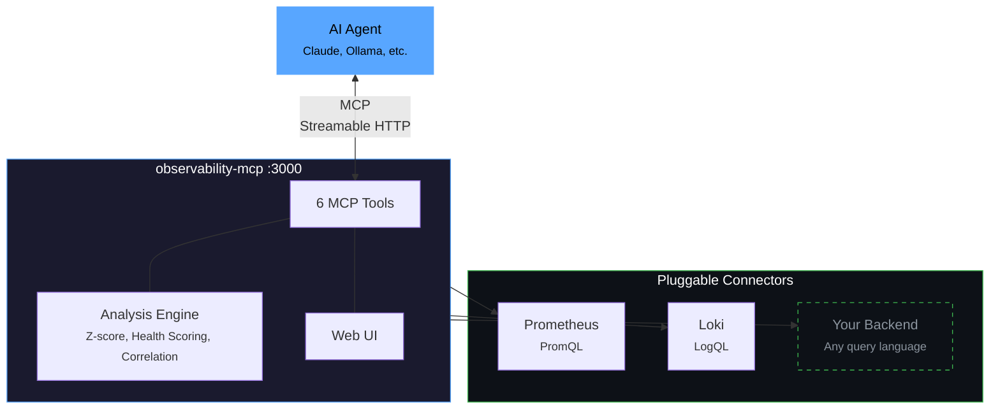

<div align="center">

# observability-mcp

**The unified observability gateway for AI agents.**

One MCP server that connects to any observability backend through pluggable connectors,
normalizes the data, adds intelligent analysis, and provides a web UI for configuration.

*What Grafana did for dashboards, we do for AI agents.*

[](LICENSE)
[](https://www.npmjs.com/package/@thotischner/observability-mcp)
[](https://github.com/ThoTischner/observability-mcp/pkgs/container/observability-mcp)
[](https://www.typescriptlang.org/)
[](https://modelcontextprotocol.io)
[](./helm/observability-mcp)
[](https://docs.npmjs.com/generating-provenance-statements)


</div>

---

## Try it in 10 seconds

```bash
npx @thotischner/observability-mcp
# then open http://localhost:3000
```

The server starts with **zero sources**. Add Prometheus/Loki via the Web UI or `PROMETHEUS_URL` / `LOKI_URL` env vars.

## Why?

Every observability vendor ships its own MCP server — Prometheus, Grafana, Datadog, Elastic, each siloed. AI agents that need to reason across systems must juggle N separate servers. There is no unified abstraction layer.

**observability-mcp** is that layer.

## Features

- **Unified gateway** — Single MCP endpoint for all your observability backends.
- **Cross-signal analysis** — Correlates metrics and logs automatically (z-score anomalies, weighted health scoring).
- **Web UI** — Sources, services, health monitoring, configuration. Real-time, dark theme.
- **prom-client defaults** — Works out of the box with the standard Node.js Prometheus instrumentation. Dynamic label resolution probes `job` / `service` / `app` / `service_name` so service filtering Just Works.
- **Loki label fallback** — Discovers services through `service_name` / `service` / `job` / `app` / `container`, including Docker-shipped streams with leading slashes.
- **Pluggable connectors** — One interface, any query language (PromQL, LogQL, Flux, KQL...). See [docs/connectors.md](docs/connectors.md).
- **Auth & TLS** — Basic, Bearer, custom CA, mTLS. See [docs/auth-and-tls.md](docs/auth-and-tls.md).
- **Multi-backend** — Multiple instances of the same type, no problem.

## Architecture



## Installation

| Method | Command | Best for |
|--------|---------|----------|
| **npm** | `npx @thotischner/observability-mcp` | Local dev, Node toolchains, zero install |
| **Docker (GHCR)** | `docker run -p 3000:3000 ghcr.io/thotischner/observability-mcp:latest` | Production, Kubernetes, isolation |
| **From source** | `git clone … && docker-compose up` | Full POC with example services and chaos |

GHCR is multi-arch (amd64 + arm64). Available tags: `latest`, `main`, `X.Y.Z`, `X.Y`, `X`, `sha-<commit>`. Note: the leading `v` is stripped from semver tags.

```yaml
# docker-compose snippet
services:
  observability-mcp:
    image: ghcr.io/thotischner/observability-mcp:latest
    ports: ["3000:3000"]
    environment:
      PROMETHEUS_URL: http://prometheus:9090
      LOKI_URL: http://loki:3100
    volumes:
      - ./mcp-config:/home/node/.observability-mcp
    restart: unless-stopped
```

For full configuration — paths, env vars, `${VAR}` substitution, complete `sources.yaml` reference — see [docs/configuration.md](docs/configuration.md).

## Quick Start

### Option A: Standalone (your own backends)

```bash
npx @thotischner/observability-mcp
```

Then open the Web UI at `http://localhost:3000`, click **Sources → + Add Source**, point at your Prometheus/Loki URLs. Or skip the UI:

```bash
PROMETHEUS_URL=http://localhost:9090 LOKI_URL=http://localhost:3100 \
  npx @thotischner/observability-mcp
```

### Option B: Grafana Cloud

Grafana Cloud uses Basic Auth with your numeric instance ID as username and an API token as password. The instance ID for Prometheus and Loki is different — find both in *Connections → Data sources*.

```yaml
# ~/.observability-mcp/sources.yaml
sources:
  - name: grafana-cloud-prom
    type: prometheus
    url: https://prometheus-prod-XX-prod-eu-west-X.grafana.net/api/prom
    enabled: true
    auth:
      type: basic
      username: "${GRAFANA_PROM_USER}"   # numeric instance ID
      password: "${GRAFANA_TOKEN}"
  - name: grafana-cloud-loki
    type: loki
    url: https://logs-prod-XXX.grafana.net
    enabled: true
    auth:
      type: basic
      username: "${GRAFANA_LOKI_USER}"   # different from Prom!
      password: "${GRAFANA_TOKEN}"
```

```bash
GRAFANA_PROM_USER=… GRAFANA_LOKI_USER=… GRAFANA_TOKEN=glc_… \
  npx @thotischner/observability-mcp
```

### Option C: Full demo (Docker Compose with example services)

```bash
git clone https://github.com/ThoTischner/observability-mcp.git
cd observability-mcp
docker-compose up --build
```

Boots 8 containers with health checks: 3 example microservices, Prometheus, Loki, Promtail, the MCP server, and the agent. Open `http://localhost:3000`.

## MCP Tools

| Tool | Signal | Purpose |
|------|--------|---------|
| `list_sources` | meta | Discover configured backends and connection status |
| `list_services` | meta | Discover monitored services across all backends |
| `query_metrics` | metrics | Query metrics with pre-computed summary stats |
| `query_logs` | logs | Query logs with error/warning counts and top patterns |
| `get_service_health` | unified | Health score combining metrics + logs (0–100) |
| `detect_anomalies` | unified | Cross-signal anomaly detection with z-score analysis |

## Using with Claude Code

Connect Claude Code directly — no agent needed.

**CLI:**

```bash
claude mcp add observability --transport http http://localhost:3000/mcp
```

**Or `.mcp.json` in your project root** (commit-friendly):

```json
{
  "mcpServers": {
    "observability": {
      "transport": { "type": "http", "url": "http://localhost:3000/mcp" }
    }
  }
}
```

Then ask Claude in natural language. For example, after triggering chaos in the demo (`curl -X POST http://localhost:8081/chaos/error-spike`):

> *"Are there any anomalies right now?"*

Claude calls `detect_anomalies` and finds:

```json
{
  "anomalies": [
    { "metric": "cpu", "severity": "high", "service": "payment-service",
      "description": "cpu is 3.4σ above baseline (18.36 → 37.31)" },
    { "metric": "request_rate", "severity": "low", "service": "payment-service",
      "description": "request_rate is -1.8σ below baseline (0.08 → 0.04)" }
  ]
}
```

> *"Show me the error logs for payment-service."*

Claude calls `query_logs`:

```json
{
  "summary": {
    "total": 11, "errorCount": 11,
    "topPatterns": [
      "Request failed: internal error during POST /payments (6x)",
      "Request failed: internal error during POST /refunds (4x)"
    ]
  }
}
```

Claude correlates the signals — CPU spike, error logs flooding, request rate halved — and explains the incident in plain language. No PromQL, no LogQL.

## Demo: Chaos Engineering

Three example microservices generate traffic and support chaos injection:

```bash
curl -X POST http://localhost:8081/chaos/high-cpu        # CPU spike
curl -X POST http://localhost:8081/chaos/error-spike     # CPU + latency + errors
curl -X POST http://localhost:8081/chaos/slow-responses  # Latency
curl -X POST http://localhost:8081/chaos/memory-leak     # OOM logs
curl -X POST http://localhost:8081/chaos/reset
```

The agent ([docs/agent.md](docs/agent.md)) detects anomalies within 30 seconds and produces an LLM incident analysis if Ollama is running.

## Docs

- [Configuration](docs/configuration.md) — paths, env vars, `${VAR}` substitution, full `sources.yaml` reference
- [Authentication & TLS](docs/auth-and-tls.md) — Basic, Bearer, custom CA, mTLS
- [Prometheus](docs/prometheus.md) — defaults, label resolution, `resolvedSeries`, prom-client compatibility
- [Loki](docs/loki.md) — label fallback, Docker container slash, managed Loki
- [Connectors](docs/connectors.md) — write your own backend
- [Agent](docs/agent.md) — Ollama setup, loop behavior
- [Troubleshooting](docs/troubleshooting.md) — common pitfalls and fixes
- [Security](docs/security.md) — automation pipeline, vulnerability reporting, built-in protections

## Endpoints

| Service | URL |
|---------|-----|
| MCP Server (Streamable HTTP) | http://localhost:3000/mcp |
| Web UI | http://localhost:3000 |
| Health API | http://localhost:3000/api/health |

In the docker-compose demo: Prometheus on `:9090`, Loki on `:3100`, services on `:8080–:8082`.

## Tech Stack

TypeScript + Node 20, `@modelcontextprotocol/sdk` (Streamable HTTP), Express, Zod, js-yaml, prom-client (example services), Prometheus, Loki, Promtail, Docker Compose, optional Ollama.

## Requirements

- **Standalone:** Node 20+ (or just `npx`)
- **Docker demo:** Docker + Compose, 4 GB+ RAM (8 GB+ with Ollama)
- **Optional:** Ollama on the host for the agent's LLM analysis

## Contributing

1. Fork the repo and `docker-compose up --build`.
2. Pick an issue or open one to discuss your idea.
3. Submit a PR — all code runs in Docker, no local deps.

Ideas: new connectors (InfluxDB, Elasticsearch, Datadog), additional analysis algorithms, UI improvements.

## License

MIT

---

<div align="center">

If you find this useful, consider giving it a star — it helps others discover the project.

</div>
