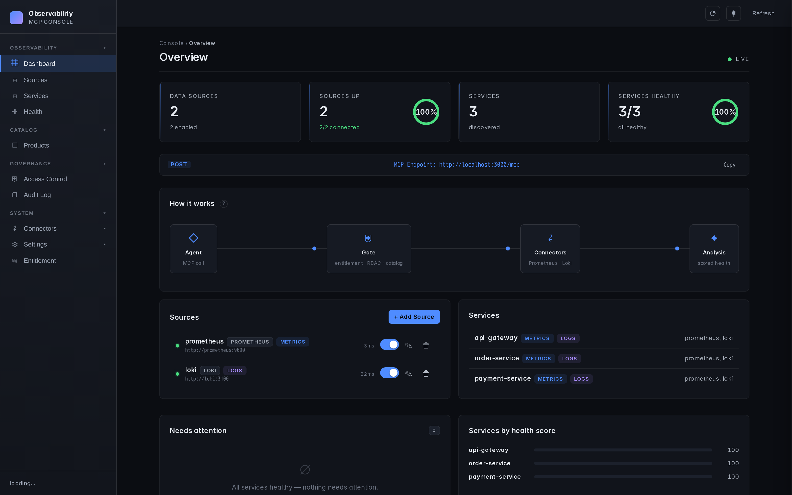
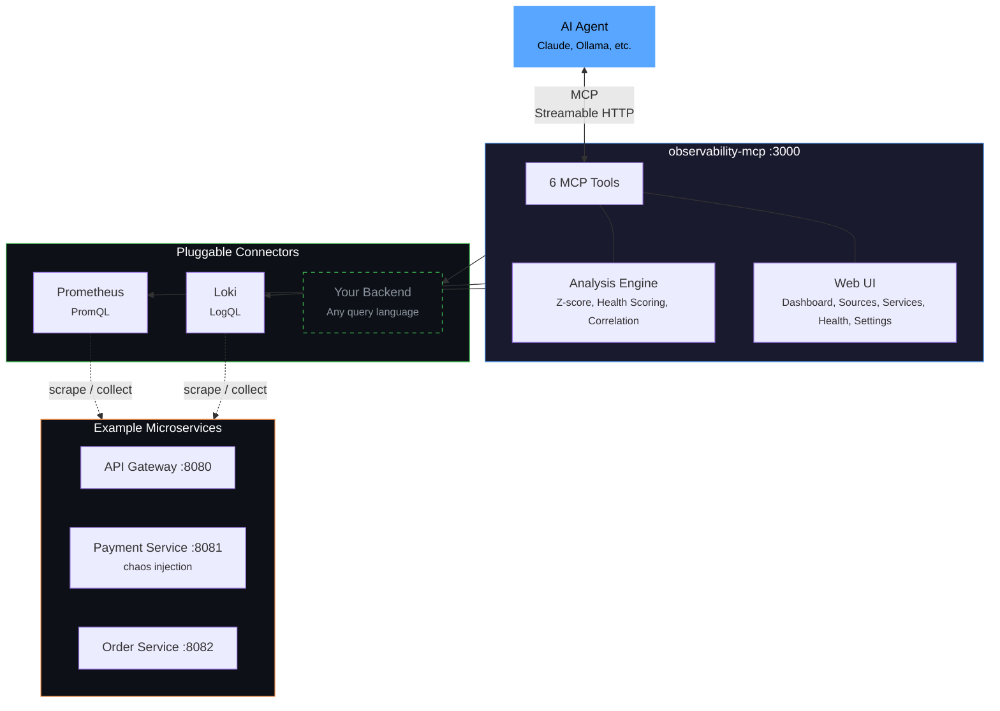

<div align="center">

# observability-mcp

**The unified observability gateway for AI agents.**

One MCP server that connects to any observability backend through pluggable connectors,
normalizes the data, adds intelligent analysis, and provides a web UI for configuration.

*What Grafana did for dashboards, we do for AI agents.*

[](LICENSE)
[](docker-compose.yml)
[](https://www.typescriptlang.org/)
[](https://modelcontextprotocol.io)



</div>

---

## Why?

Every observability vendor ships its own MCP server — Prometheus, Grafana, Datadog, Elastic, each siloed. AI agents that need to reason across systems must juggle N separate servers. There is no unified abstraction layer.

**observability-mcp** is that layer.

## Features

- **Unified Gateway** — Single MCP endpoint for all your observability backends. Prometheus, Loki, and any future connector through one interface.
- **Cross-Signal Analysis** — Correlates metrics and logs automatically. Detects patterns like "CPU spike + error logs = resource saturation" across signals.
- **LLM Incident Analysis** — Agent detects anomalies via z-score analysis, then uses Ollama for multi-turn root cause analysis with severity classification (P1-P4).
- **Web UI** — 5-page management interface for sources, services, health monitoring, and configuration. Dark theme, real-time updates.
- **Chaos Engineering** — Built-in demo with 3 microservices and chaos injection (CPU spikes, error floods, memory leaks) — all correlated across signals.
- **Pluggable Connectors** — Add new backends by implementing one interface. Each connector owns its native query language (PromQL, LogQL, Flux, KQL...).
- **Authentication & TLS** — Connect to secured backends with Basic Auth, Bearer Token, custom CA certificates, and mutual TLS (mTLS). Configurable per source via Web UI or YAML.
- **Multi-Backend Support** — Connect multiple instances of the same backend type. Two Prometheus clusters? Three Loki instances? Just add more sources.

## Architecture



## How It Works

```
1. Services emit          2. Backends collect        3. MCP normalizes         4. Agent analyzes
┌─────────────────┐      ┌──────────────────┐      ┌──────────────────┐      ┌──────────────────┐
│ Your services    │ ──── │ Prometheus       │ ──── │ observability-   │ ──── │ LLM detects      │
│ emit metrics     │      │ scrapes metrics   │      │ mcp unifies     │      │ anomalies,       │
│ and logs         │      │ Loki collects    │      │ 6 tools + UI    │      │ correlates, and  │
│                  │      │ logs via Promtail │      │                  │      │ explains          │
└─────────────────┘      └──────────────────┘      └──────────────────┘      └──────────────────┘
```

## Quick Start

### Option A: Standalone (connect to your own backends)

```bash
npx observability-mcp
```

The server starts on **http://localhost:3000**. No backends are configured yet — add them through the Web UI:

1. Open **http://localhost:3000** → go to **Sources**
2. Click **+ Add Source** → select type (Prometheus, Loki), enter your backend URL
3. The source connects immediately — go to **Services** to see auto-discovered services
4. Point your AI client (Claude, etc.) to the MCP endpoint: `http://localhost:3000/mcp`

Configuration is saved to `~/.observability-mcp/sources.yaml` and persists across restarts. For secured backends, see [Authentication & TLS](#authentication--tls).

You can also skip the Web UI and configure via environment variables:

```bash
PROMETHEUS_URL=http://localhost:9090 LOKI_URL=http://localhost:3100 npx observability-mcp
```

### Option B: Full Demo (Docker Compose with example services)

```bash
git clone https://github.com/ThoTischner/observability-mcp.git
cd observability-mcp
docker-compose up --build
```

This starts all 8 containers with health checks and dependency ordering:

1. Example services start and generate traffic automatically
2. Prometheus scrapes metrics, Loki collects logs via Promtail
3. MCP server connects to both backends
4. Agent starts the detection loop (with optional Ollama integration)

Open **http://localhost:3000** for the Web UI.

## MCP Tools

| Tool | Signal | Purpose |
|------|--------|---------|
| `list_sources` | meta | Discover configured backends and their connection status |
| `list_services` | meta | Discover monitored services across all backends |
| `query_metrics` | metrics | Query metrics with pre-computed summary stats (dynamic metric list) |
| `query_logs` | logs | Query logs with error/warning counts and top patterns |
| `get_service_health` | unified | Health score combining metrics + logs (0-100, configurable) |
| `detect_anomalies` | unified | Cross-signal anomaly detection with z-score analysis |

## Web UI

The management UI at **http://localhost:3000** has 5 pages:

- **Dashboard** — overview of sources, services, MCP endpoint
- **Sources** — add/edit/delete/test backends with authentication (Basic/Bearer), TLS settings (custom CA, mTLS, skip verify), and enable/disable toggle
- **Services** — auto-discovered services across all backends
- **Health** — real-time health cards with scores, metrics, anomalies (auto-refresh)
- **Settings** — General (check interval, sensitivity), Health Scoring (thresholds, weights), Source Metrics (per-source query definitions)

## Demo: Chaos Engineering

Three example microservices generate traffic automatically and support chaos injection:

```bash
# Trigger CPU spike on payment service
curl -X POST http://localhost:8081/chaos/high-cpu

# Trigger error spike (correlated: also increases CPU + latency + error logs)
curl -X POST http://localhost:8081/chaos/error-spike

# Trigger slow responses (correlated: increases CPU)
curl -X POST http://localhost:8081/chaos/slow-responses

# Trigger memory leak (correlated: generates OOM error logs)
curl -X POST http://localhost:8081/chaos/memory-leak

# Reset all chaos
curl -X POST http://localhost:8081/chaos/reset
```

The agent detects anomalies within 30 seconds and produces an incident analysis (if Ollama is running).

## Using with Claude Code

Connect Claude Code directly to your observability stack — no agent needed. Add the MCP server to your project:

```bash
claude mcp add observability --transport http http://localhost:3000/mcp
```

Then ask Claude to investigate your infrastructure using natural language. Claude will call the MCP tools automatically.

### Example: Health Check

**Prompt:** *"Check the health of all services"*

Claude calls `get_service_health` for each service and returns:

```json
{
  "service": "payment-service",
  "status": "healthy",
  "score": 100,
  "signals": {
    "metrics": { "cpu": 17.2, "memory": 125.0, "errorRate": 0, "latencyP99": 0.0099 },
    "logs": { "errorRate": 0, "topErrors": [] }
  },
  "anomalies": [],
  "correlations": []
}
```

### Example: Incident Investigation

After triggering chaos (`curl -X POST http://localhost:8081/chaos/error-spike`), ask Claude: *"Are there any anomalies?"*

Claude calls `detect_anomalies` and finds:

```json
{
  "scannedServices": 3,
  "anomalies": [
    {
      "metric": "cpu",
      "severity": "high",
      "description": "cpu is 3.4σ above baseline (18.36 → 37.31)",
      "currentValue": 37.31,
      "baselineValue": 18.36,
      "deviationPercent": 103,
      "service": "payment-service"
    },
    {
      "metric": "request_rate",
      "severity": "low",
      "description": "request_rate is -1.8σ below baseline (0.08 → 0.04)",
      "currentValue": 0.04,
      "baselineValue": 0.08,
      "deviationPercent": -55,
      "service": "payment-service"
    }
  ],
  "summary": "2 anomalies detected across 1 service(s)."
}
```

Then ask *"Show me the error logs for payment-service"* — Claude calls `query_logs`:

```json
{
  "service": "payment-service",
  "summary": {
    "total": 11,
    "errorCount": 11,
    "warnCount": 0,
    "topPatterns": [
      "Request failed: internal error during POST /payments (6x)",
      "Request failed: internal error during POST /refunds (4x)",
      "Request failed: internal error during GET / (1x)"
    ]
  }
}
```

Claude correlates the signals: CPU spike (+114%), error logs flooding, request rate halved — and explains the incident in plain language. All without writing a single PromQL or LogQL query.

## Ollama Integration (Agent only)

The **agent** (not the MCP server) uses Ollama for LLM-powered incident analysis. The MCP server itself is LLM-agnostic — it just provides tools and data.

```bash
ollama serve
ollama pull llama3.1:8b
```

The agent is configured entirely via environment variables:

| Variable | Default | Description |
|----------|---------|-------------|
| `OLLAMA_URL` | `http://host.docker.internal:11434` | Ollama API endpoint |
| `OLLAMA_MODEL` | `llama3.1:8b` | Model for incident analysis |
| `SYSTEM_PROMPT` | *(built-in SRE prompt)* | Custom instructions for the LLM |
| `CHECK_INTERVAL` | `30000` | Detection loop interval (ms) |

If Ollama is unavailable, the agent falls back to raw anomaly JSON output.

## Adding a New Connector

Each connector type brings its own default metrics in its native query language.

1. Create `mcp-server/src/connectors/<name>.ts`
2. Implement the `ObservabilityConnector` interface (see `interface.ts`)
3. Implement `getDefaultMetrics()` returning `MetricDefinition[]` with backend-specific queries
4. Register the factory in `mcp-server/src/connectors/registry.ts`
5. Add a source via the Web UI or `config/sources.yaml`

Example: an InfluxDB connector would return Flux queries in `getDefaultMetrics()`, an Elasticsearch connector would return KQL queries.

## Authentication & TLS

Every source supports optional authentication and TLS configuration — via the Web UI or in `sources.yaml`.

### Basic Auth

```yaml
sources:
  - name: prometheus-prod
    type: prometheus
    url: https://prometheus.internal:9090
    enabled: true
    auth:
      type: basic
      username: admin
      password: secret
```

### Bearer Token

Common for Grafana Cloud, managed Prometheus/Loki, or OAuth2 proxy setups.

```yaml
sources:
  - name: grafana-cloud-metrics
    type: prometheus
    url: https://prometheus-us-central1.grafana.net/api/prom
    enabled: true
    auth:
      type: bearer
      token: glc_eyJ...
```

### Custom CA Certificate (self-signed certs)

Instead of disabling TLS verification, provide your CA certificate for secure validation:

```yaml
sources:
  - name: prometheus-internal
    type: prometheus
    url: https://prometheus.corp:9090
    enabled: true
    tls:
      caCert: /etc/ssl/custom-ca.pem
```

### Mutual TLS (mTLS)

For environments that require client certificate authentication:

```yaml
sources:
  - name: prometheus-mtls
    type: prometheus
    url: https://prometheus.secure:9090
    enabled: true
    tls:
      caCert: /etc/ssl/ca.pem
      clientCert: /etc/ssl/client.pem
      clientKey: /etc/ssl/client-key.pem
```

### Skip TLS Verification

For development or testing with self-signed certificates where you don't have the CA:

```yaml
sources:
  - name: prometheus-dev
    type: prometheus
    url: https://prometheus.dev:9090
    enabled: true
    tls:
      skipVerify: true
```

All of these options are also available in the Web UI under **Sources > Add/Edit Source**.

## Configuration

All configuration is managed via the Web UI and persisted to `sources.yaml`:
- **Standalone:** `~/.observability-mcp/sources.yaml`
- **Docker:** `config/sources.yaml`

```yaml
sources:
  - name: prometheus
    type: prometheus
    url: http://localhost:9090           # or http://prometheus:9090 in Docker
    enabled: true
    # auth:                              # Optional: authentication
    #   type: bearer
    #   token: eyJ...
    # tls:                               # Optional: TLS settings
    #   caCert: /path/to/ca.pem
    #   clientCert: /path/to/client.pem  # Optional: mTLS
    #   clientKey: /path/to/client-key.pem
    # metrics: [...]                     # Optional: override default metrics

  - name: loki
    type: loki
    url: http://localhost:3100           # or http://loki:3100 in Docker
    enabled: true

settings:
  checkIntervalMs: 30000
  defaultSensitivity: medium             # low, medium, high

healthThresholds:
  weights: { errorRate: 0.35, latency: 0.25, cpu: 0.20, logErrors: 0.20 }
  cpu: { good: 50, warn: 80, crit: 95 }
  errorRate: { good: 0.01, warn: 0.1, crit: 0.5 }
  latencyP99: { good: 0.5, warn: 1.0, crit: 3.0 }
  logErrors: { good: 1, warn: 5, crit: 20 }
  statusBoundaries: { healthy: 80, degraded: 50 }
```

### Environment Variables

For quick setup without a config file — the server picks these up when no `sources.yaml` exists:

| Variable | Description | Example |
|----------|-------------|---------|
| `PORT` | HTTP port for MCP endpoint and Web UI (default: `3000`) | `8080` |
| `PROMETHEUS_URL` | Prometheus URL(s), comma-separated for multiple | `http://prom1:9090,http://prom2:9090` |
| `LOKI_URL` | Loki URL(s), comma-separated for multiple | `http://loki1:3100,http://loki2:3100` |
| `CONFIG_PATH` | Custom path to `sources.yaml` | `/etc/observability-mcp/sources.yaml` |

```bash
# Single backend
PROMETHEUS_URL=http://localhost:9090 npx observability-mcp

# Multiple backends on custom port
PROMETHEUS_URL=http://prom1:9090,http://prom2:9090 \
LOKI_URL=http://loki1:3100,http://loki2:3100 \
PORT=8080 \
npx observability-mcp
```

## Endpoints

**Always available (standalone & Docker):**

| Service | URL |
|---------|-----|
| MCP Server (Streamable HTTP) | http://localhost:3000/mcp |
| Web UI | http://localhost:3000 |

**Docker Compose demo only:**

| Service | URL |
|---------|-----|
| Prometheus | http://localhost:9090 |
| Loki | http://localhost:3100 |
| API Gateway | http://localhost:8080 |
| Payment Service | http://localhost:8081 |
| Order Service | http://localhost:8082 |

## Tech Stack

- TypeScript, Node 20 (all components)
- `@modelcontextprotocol/sdk` (MCP server + client, Streamable HTTP transport)
- Express, Zod, js-yaml
- `prom-client` (example service metrics)
- Prometheus, Loki, Promtail (observability stack)
- Ollama (local LLM for incident analysis)
- Docker Compose with health checks

## Requirements

**Standalone:** Node.js 20+ (or just use `npx`)

**Docker Demo:** Docker and Docker Compose, 4GB+ RAM (8GB+ with Ollama)

**Optional:** Ollama on host machine for AI-powered incident analysis

## Contributing

Contributions are welcome! The easiest way to get started:

1. Fork the repo and `docker-compose up --build`
2. Pick an issue or open one to discuss your idea
3. Submit a PR — all code runs in Docker, no local dependencies needed

Ideas: new connectors (InfluxDB, Elasticsearch, Datadog), additional analysis algorithms, UI improvements.

## License

MIT

---

<div align="center">

If you find this useful, consider giving it a star — it helps others discover the project.

</div>
