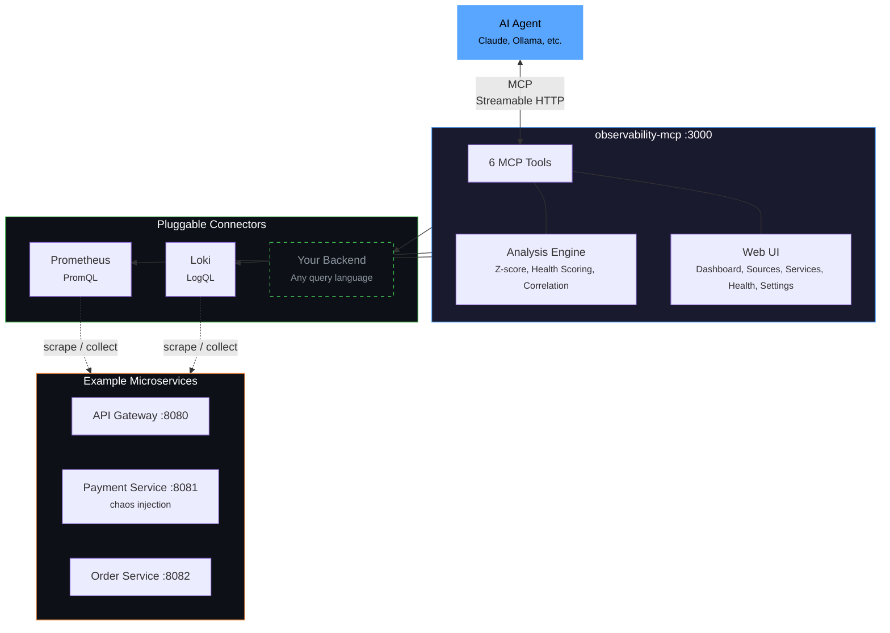

<div align="center">

# observability-mcp

**The unified observability gateway for AI agents.**

One MCP server that connects to any observability backend through pluggable connectors,
normalizes the data, adds intelligent analysis, and provides a web UI for configuration.

*What Grafana did for dashboards, we do for AI agents.*

[](LICENSE)
[](docker-compose.yml)
[](https://www.typescriptlang.org/)
[](https://modelcontextprotocol.io)


</div>

---

## Why?

Every observability vendor ships its own MCP server — Prometheus, Grafana, Datadog, Elastic, each siloed. AI agents that need to reason across systems must juggle N separate servers. There is no unified abstraction layer.

**observability-mcp** is that layer.

## Features

- **Unified Gateway** — Single MCP endpoint for all your observability backends. Prometheus, Loki, and any future connector through one interface.
- **Cross-Signal Analysis** — Correlates metrics and logs automatically. Detects patterns like "CPU spike + error logs = resource saturation" across signals.
- **LLM Incident Analysis** — Agent detects anomalies via z-score analysis, then uses Ollama for multi-turn root cause analysis with severity classification (P1-P4).
- **Web UI** — 5-page management interface for sources, services, health monitoring, and configuration. Dark theme, real-time updates.
- **Chaos Engineering** — Built-in demo with 3 microservices and chaos injection (CPU spikes, error floods, memory leaks) — all correlated across signals.
- **Pluggable Connectors** — Add new backends by implementing one interface. Each connector owns its native query language (PromQL, LogQL, Flux, KQL...).

## Architecture



## How It Works

```
1. Services emit          2. Backends collect        3. MCP normalizes         4. Agent analyzes
┌─────────────────┐      ┌──────────────────┐      ┌──────────────────┐      ┌──────────────────┐
│ Your services    │ ──── │ Prometheus       │ ──── │ observability-   │ ──── │ LLM detects      │
│ emit metrics     │      │ scrapes metrics   │      │ mcp unifies     │      │ anomalies,       │
│ and logs         │      │ Loki collects    │      │ 6 tools + UI    │      │ correlates, and  │
│                  │      │ logs via Promtail │      │                  │      │ explains          │
└─────────────────┘      └──────────────────┘      └──────────────────┘      └──────────────────┘
```

## Quick Start

```bash
git clone https://github.com/ThoTischner/observability-mcp.git
cd observability-mcp
docker-compose up --build
```

That's it. All 8 containers start with health checks and dependency ordering:

1. Example services start and generate traffic automatically
2. Prometheus scrapes metrics, Loki collects logs via Promtail
3. MCP server connects to both backends
4. Agent starts the detection loop

Open **http://localhost:3000** for the Web UI.

## MCP Tools

| Tool | Signal | Purpose |
|------|--------|---------|
| `list_sources` | meta | Discover configured backends and their connection status |
| `list_services` | meta | Discover monitored services across all backends |
| `query_metrics` | metrics | Query metrics with pre-computed summary stats (dynamic metric list) |
| `query_logs` | logs | Query logs with error/warning counts and top patterns |
| `get_service_health` | unified | Health score combining metrics + logs (0-100, configurable) |
| `detect_anomalies` | unified | Cross-signal anomaly detection with z-score analysis |

## Web UI

The management UI at **http://localhost:3000** has 5 pages:

- **Dashboard** — overview of sources, services, MCP endpoint
- **Sources** — add/edit/delete/test backends, toggle enabled/disabled
- **Services** — auto-discovered services across all backends
- **Health** — real-time health cards with scores, metrics, anomalies (auto-refresh)
- **Settings** — General (agent config, Ollama, system prompt), Health Scoring (thresholds, weights), Source Metrics (per-source query definitions)

## Demo: Chaos Engineering

Three example microservices generate traffic automatically and support chaos injection:

```bash
# Trigger CPU spike on payment service
curl -X POST http://localhost:8081/chaos/high-cpu

# Trigger error spike (correlated: also increases CPU + latency + error logs)
curl -X POST http://localhost:8081/chaos/error-spike

# Trigger slow responses (correlated: increases CPU)
curl -X POST http://localhost:8081/chaos/slow-responses

# Trigger memory leak (correlated: generates OOM error logs)
curl -X POST http://localhost:8081/chaos/memory-leak

# Reset all chaos
curl -X POST http://localhost:8081/chaos/reset
```

The agent detects anomalies within 30 seconds and produces an incident analysis (if Ollama is running).

## Ollama Integration

The agent connects to Ollama on the **host machine** (not in Docker — WSL2 GPU passthrough is unreliable):

```bash
# On your host, install Ollama and pull a model
ollama serve
ollama pull llama3.1:8b
```

The agent auto-detects Ollama via `host.docker.internal:11434`. If unavailable, it falls back to raw anomaly output. Model, URL, and system prompt are configurable via the Web UI (Settings > General).

## Adding a New Connector

Each connector type brings its own default metrics in its native query language.

1. Create `mcp-server/src/connectors/<name>.ts`
2. Implement the `ObservabilityConnector` interface (see `interface.ts`)
3. Implement `getDefaultMetrics()` returning `MetricDefinition[]` with backend-specific queries
4. Register the factory in `mcp-server/src/connectors/registry.ts`
5. Add a source via the Web UI or `config/sources.yaml`

Example: an InfluxDB connector would return Flux queries in `getDefaultMetrics()`, an Elasticsearch connector would return KQL queries.

## Configuration

All configuration is managed via the Web UI and persisted to `config/sources.yaml`. Structure:

```yaml
sources:
  - name: prometheus
    type: prometheus
    url: http://prometheus:9090
    enabled: true
    # metrics: [...]  # Optional: override default metrics for this source

  - name: loki
    type: loki
    url: http://loki:3100
    enabled: true

settings:
  checkIntervalMs: 30000
  defaultSensitivity: medium
  ollamaUrl: http://host.docker.internal:11434
  ollamaModel: llama3.1:8b

healthThresholds:
  weights: { errorRate: 0.35, latency: 0.25, cpu: 0.20, logErrors: 0.20 }
  cpu: { good: 50, warn: 80, crit: 95 }
  errorRate: { good: 0.01, warn: 0.1, crit: 0.5 }
  latencyP99: { good: 0.5, warn: 1.0, crit: 3.0 }
  logErrors: { good: 1, warn: 5, crit: 20 }
  statusBoundaries: { healthy: 80, degraded: 50 }
```

## Endpoints

| Service | URL |
|---------|-----|
| MCP Server (Streamable HTTP) | http://localhost:3000/mcp |
| Web UI | http://localhost:3000 |
| Prometheus | http://localhost:9090 |
| Loki | http://localhost:3100 |
| API Gateway | http://localhost:8080 |
| Payment Service | http://localhost:8081 |
| Order Service | http://localhost:8082 |

## Tech Stack

- TypeScript, Node 20 (all components)
- `@modelcontextprotocol/sdk` (MCP server + client, Streamable HTTP transport)
- Express, Zod, js-yaml
- `prom-client` (example service metrics)
- Prometheus, Loki, Promtail (observability stack)
- Ollama (local LLM for incident analysis)
- Docker Compose with health checks

## Requirements

- Docker and Docker Compose
- 4GB+ RAM (8GB+ if running Ollama)
- Ollama on host machine (optional, for AI analysis)

## Contributing

Contributions are welcome! The easiest way to get started:

1. Fork the repo and `docker-compose up --build`
2. Pick an issue or open one to discuss your idea
3. Submit a PR — all code runs in Docker, no local dependencies needed

Ideas: new connectors (InfluxDB, Elasticsearch, Datadog), additional analysis algorithms, UI improvements.

## License

MIT

---

<div align="center">

If you find this useful, consider giving it a star — it helps others discover the project.

</div>
